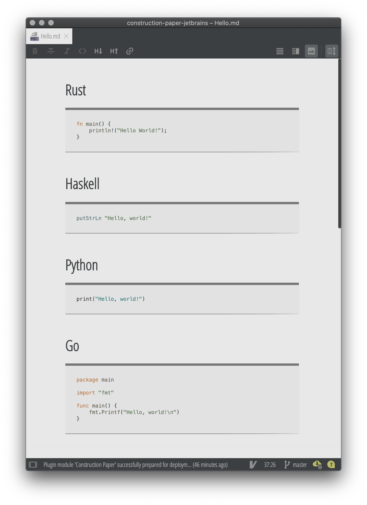

# Construction Paper

A construction paper inspired theme for Jetbrains IDEs.

## Palette

## Screenshot

## Fonts

* Fixed Width: [Average Mono](https://fontlibrary.org/en/font/average-mono)
* Variable Width: [Open Sans Condensed](https://fonts.google.com/specimen/Open+Sans+Condensed?query=open+sans)

## Markdown CSS

To use the markdown CSS styles, copy and paste the contents of
 [markdown.css](https://raw.githubusercontent.com/matthias-margush/construction-paper-jetbrains/master/markdown.css)
 to the "Add CSS Rules" text area in
`Preferences > Languages and Frameworks > Markdown`.

